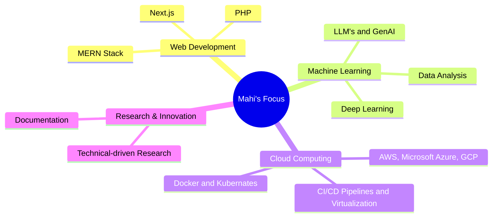

#  Hey there, I'm Mahi Shah!

<div align="center">
  
</div>

<p align="center">
  
  
</p>

---

## About Me

```javascript
const mahishah = {
    location: "Ahmedabad, Gujarat, India",
    education: "B.Tech Computer Engineering @Pandit Deendayal Energy University (2022-2026)",
    reserach-internship: "IIT-Gandhinagar",
    currentFocus: ["Machine Learning", "Web Development", "Research Work"],
    achievements: [
        "Top100 teams in Google's Solution Challenge Hackathon 2025",
        "Published a conference paper at IEEE AIMV 2025",
        "Scored 43/50 in Cambridge English Placement Test"
    ],
    activities: [
        "Attended technical workshops & completed online courses",
        "Participated in Myntra Hackerramp WeForShe, SIH-2024, Google's Solution Challenge Hackathon, NIT Patna's ByteVerse Annual Hackathon",
        "Vice-Chairperson @ACM-PDEU (2024-2025), Research Head @CSI-PDEU (2024-2025)"
    ],
    funFact: "I treat AI facts like bedtime stories with oreo shake"
};
```

## 💼 Professional Experience

<table>
<tr>
<td>

**🔬 Research Intern**  
*5G Use Case lab, IIT Gandhinagar* | May 2025 - August 2025  
- 5G-based positioning research for anomaly and hostage detection.
- Real-time clustering and visualization for crowd behavior analysis.
- Showcase : https://labs.iitgn.ac.in/5gusecaselab/ai-ml-project-5g/

</td>
</table>


## 🛠️ Tech Arsenal

<div align="center">

### Programming Languages


### Web Development


### Database & Tools


</div>

## 📊 GitHub Analytics

<div align="center">
  
  
</div>

<div align="center">
  
</div>

<div align="center">
  
</div>

## 🚀 Featured Projects

<div align="center">
<table>
<tr>
<td width="50%">

### 🏪 [GradeFlow - AI Assistant For Teacher](https://github.com/mahishah05/GradeFlow)
A robust, AI-driven educational evaluation platform built to revolutionize academic assessment in high-volume educational environments like India.


**Tech Stack:** `Python` `Streamlit` `Langchain` `FAISS`

</td>
<td width="50%">

### 🎉 [EventEase - Event Management & Ticket Booking Platform](https://github.com/maitreemistry/event-management-platform) 
Full-featured event management solution with booking and notification systems.

**Tech Stack:** `PERN`

</td>
</tr>
<tr>
<td width="50%">

### 📱 [EventEase - Event Management & Ticket Booking Platform](https://github.com/mahishah05/EventEase)
A streamlined event management and ticket-booking platform that simplifies event discovery and user engagement through intuitive, high-performance workflows.

**Tech Stack:** `TypeScript` `MongoDB`

</td>
<td width="50%">

### 🔍 [Sentiment Analysis](https://github.com/maitreemistry/sentiment-analysis-python)
ML-powered sentiment analysis tool for processing and analyzing text data emotions.

**Tech Stack:** `Python` `Machine Learning` `NLP`

</td>
</tr>
</table>
</div>

<div align="center">
  <a href="https://github.com/mahishah05?tab=repositories">
    
  </a>
</div>


## 🎯 Current Focus



## 🌟 Let's Connect!

<div align="center">
  <a href="https://www.linkedin.com/in/mahishah05">
    
  </a>
  <a href="https://github.com/mahishah05">
    
  </a>
</div>

<div align="center">
  
</div>


---


<div align="center">
    <h3>💫 "Learning never stops and neither does innovation!" 💫</h3>
  
</div>


